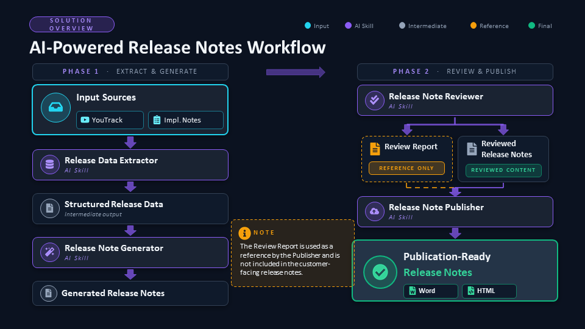

# Future AI Workflow

## AI-Powered Release Notes Workflow

This workflow automates the end-to-end release notes generation process using AI skills.

**Workflow Overview:**
1. Input Sources (YouTrack + Implementation Notes)
2. Release Data Extractor
3. Structured Release Data
4. Release Note Generator
5. Generated Release Notes
6. Release Note Reviewer
7. Review Report (Reference Only)
8. Reviewed Release Notes
9. Release Note Publisher
10. Publication-Ready Release Notes (Word & HTML)

## Workflow Diagram

